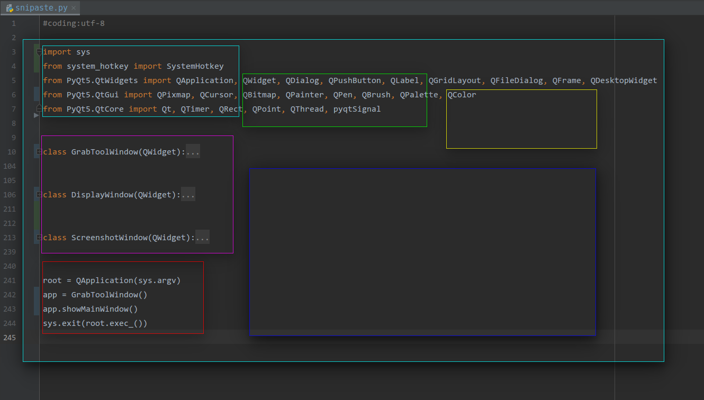

# SnipastePyQT

#### Snipaste based on PyQT5 and Python3.


## Run

```bash
sudo pip3 install xpybutil, xcffib, system_hotkey, PyQt5
git clone https://github.com/MrRen-sdhm/SnipastePyQT.git
cd SnipastePyQT
python3 snipaste.py
```


## Install

```bash
sudo chmod +x startup.sh
cd ..
sudo mv -r SnipastePyQT /opt
```


## Auto Start

Please use program auto startup manager in your system.


## Short key

- `Ctrl+Shift+J` - Take screenshot and display.
- `Alt+Q` - Close the program.
- `Q` - Close the screenshot display window.
- `S` - Save the screenshot.


## Display

